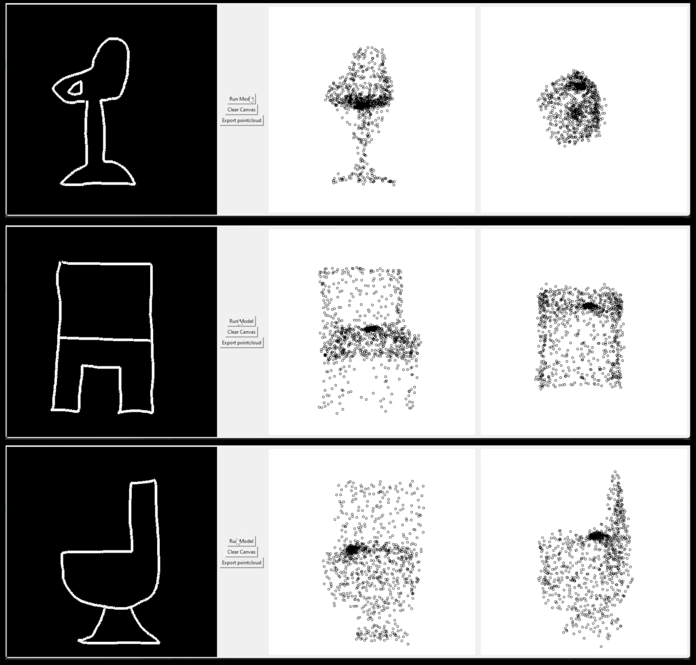

# 2D Outline of a Chair to 3D Pointcloud Generator

## Overview
This is a weekend project in which we attempted to generate a 3D pointcloud of a chair when given a 2D outline
of that chair. We have mostly achieved this, though our scope has purposefully remained limited (it is only chairs), so
its real life applications are equally limited.

This repository consists of the scripts we wrote to create training data, train a model, and a GUI environment in which we
can draw chairs and generate pointclouds (see below). We have pretrained a model which we saved in .onnx format and 
placed in the models folder, so you should be able to run the GUI environment without too many headaches.

Please adjust your expectations accordingly, as this is just a learning experience and proof of concept.




## Installation
1. Clone this repository to your local machine:
```
git clone https://github.com/martijnfolmer/ChairOutlineToPoincloud
```

2. Install the required dependencies

```
pip install -r requirements.txt
```


## Usage

### Create training data

- Open CreateTrainingData.py
- At line 356, write the path to where you want to store the training data
- At line 357, write the path to where the keras data (the .off files previously downloaded) are located.
- Run the python script
```
python CreateTrainingData.py
```

### Train model
- Open TrainOutlineToPCModel.py
- At line 124, make sure the path is pointing towards the location of where you stored the created training data
- Run the python script
```
python TrainOutlineToPCModel.py
```

### Run model and GUI

Run the GUI.
```
python RunOutlineToPC_GUI.py
```


## Model architecture

The model architecture is based on the mobilenet architecture, which is a standard convolutional neural network (CNN), 
with the last couple of layers cut off and replaced with a Dense output layer which is reshaped so the output has shape
 (1024,3).

## Dataset

The training data for the model was generated from a public dataset which can be found here :
https://3dvision.princeton.edu/projects/2014/3DShapeNets/. 

The Input of the model is a 224x224x3 image of the outline of a chair, and the output is a pointcloud which represents
a 3D representation of that chair. Both were generated from the .off files taken from the dataset above.


## Limitations:
- Please feel free to use this code in any way you see fit, but please realise that this is just a proof of concept, a weekend project and should not be used as is in any sort of professional setting.
- There were just under 1000 chairs available, all of which can be considered conventional, so data was slightly limited. 
If we wanted to get more outlandish designs of the chairs, we would have to explore model structures such as GANs and/or heavily augment the data to 
vary the design.


[A video of the results can be found here](https://www.linkedin.com/posts/martijn-folmer-68026287_computervision-machinelearning-yolo-activity-7079351112297783296-bQqT?utm_source=share&utm_medium=member_desktop) 